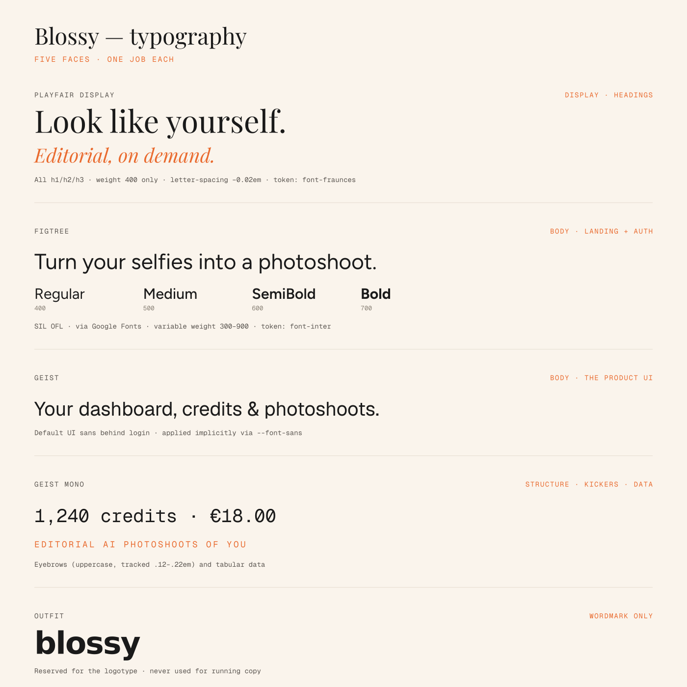

# Typography



Five faces, each with exactly one job. Every one is **SIL OFL 1.1** — free for
commercial use, including self-hosted webfonts.

| Face | Role | Source |
|---|---|---|
| Playfair Display | Display — all headings | [Google Fonts](https://fonts.google.com/specimen/Playfair+Display) |
| Figtree | Body — landing + auth | [Google Fonts](https://fonts.google.com/specimen/Figtree) |
| Geist / Geist Mono | Body — product UI · data & kickers | [vercel/geist-font](https://github.com/vercel/geist-font) |
| Outfit | Wordmark only | [Google Fonts](https://fonts.google.com/specimen/Outfit) |

The brandbook (`06_Brandbook/index.html`) embeds all five as data URIs, so it
renders identically everywhere with no font install. The same faces are mirrored
in `tools/fonts/` for rebuilds.

---

## The faces

### Playfair Display — display
Every `h1`/`h2`/`h3` site-wide. **Weight 400 only** — a global rule sets
`font-weight: 400 !important`, so `font-bold` on a heading does nothing.
Tracked at `-0.02em`. Roman + italic; italic is used for accents.
Fallback: Georgia.

> Token: `font-serif`, and `font-fraunces` (a legacy alias — it renders
> Playfair, not Fraunces).

### Figtree — body (landing + auth)
The warm body face. Variable weight 300–900; the app uses 400–700:

| Weight | Utility |
|---|---|
| 400 Regular | body default |
| 500 Medium | `font-medium` |
| 600 SemiBold | `font-semibold` |
| 700 Bold | `font-bold` |

Loaded via `next/font/google`, exposed as `--font-figtree`.

> Token: `font-inter` (another legacy alias — it renders Figtree, not Inter).

### Geist — body (product UI)
The default for everything behind login. Applied *implicitly* via
`--font-sans`, so there are no `font-sans` classes to find — it's simply what
renders when nothing else is set.

### Geist Mono — structure
Two jobs: **kickers/eyebrows** (uppercase, tracked `.12`–`.22em`, usually in
terracotta) and **tabular data** (billing amounts, step numbers).

### Outfit — the wordmark, and nothing else
Set at **600**, tracked `-1.6`, always lowercase. Reserved for the logotype.
Never use it for running copy.

Because the kit's logo SVGs have the wordmark **outlined as paths**, you don't
need Outfit installed to use them.

---

## Type scale

| Role | Spec |
|---|---|
| Hero | `clamp(2.75rem, 8.5vw, 6.5rem)` · uppercase · `leading-[0.92]` |
| Section heading | `text-4xl` → `md:text-6xl` · uppercase · `leading-[0.95]` |
| Kicker | mono · uppercase · `tracking-[0.12em–0.22em]` |
| Body | `1rem` / `1.75` |
| Headings (global) | weight 400 · `letter-spacing: -0.02em` |

---

## The two aliases (don't get caught)

```
font-fraunces  →  Playfair Display
font-inter     →  Figtree
```

Both names are legacy. The faces behind them were swapped without renaming the
tokens, so existing callsites never had to change. Trust the rendering, not
the name.
